# Đánh Giá và Đề Xuất Tinh Chỉnh Sơ Đồ Pipeline Hệ Thống DTM

Tài liệu này phân tích chi tiết sơ đồ `Pipeline hệ thống.drawio` dựa trên các tiêu chí học thuật, tính logic, thẩm mỹ và khả năng tự diễn giải (self-explanatory) cho người đọc ngoài ngành. Đồng thời, tài liệu cung cấp hướng dẫn chi tiết về cách hoạt động của hệ thống và đề xuất phương án đổi tên các thành phần chuyên nghiệp nhất.

---

## 1. Đánh giá tính chuyên nghiệp & Thẩm mỹ học thuật

Hiện tại, sơ đồ `Pipeline hệ thống.drawio` đã được vẽ rất chi tiết, có phân lớp (swimlanes) rõ ràng từ Giai đoạn 1 đến Giai đoạn 5, và có phân biệt màu sắc các vai trò (Human, LLM, Final Dataset...). Tuy nhiên, để đưa vào một **bài báo khoa học (Scientific Paper)** hoặc **báo cáo nghiên cứu học thuật**, sơ đồ này vẫn tồn tại các điểm cần tinh chỉnh như sau:

### 1.1. Thẩm mỹ và Bố cục trực quan
* **Bảng màu (Color Palette):** Sơ đồ hiện dùng quá nhiều màu sắc rực rỡ (xanh dương, tím, vàng, xanh lá, xanh ngọc, hồng). Trong các bài báo khoa học chuẩn (IEEE, ACM, Springer), sơ đồ thường sử dụng bảng màu tối giản (Greyscale, các tông xanh Navy/Slate nhã nhặn hoặc tối đa 2-3 màu chủ đạo) để tránh gây nhiễu thị giác.
* **Lỗi lệch nhãn và bounding box:** 
  * Tiêu đề của Giai đoạn 3b (`v13` tại `y=1421`) nằm ngoài khung Giai đoạn 3b (`v12` tại `y=1190, height=280`).
  * Tiêu đề Giai đoạn 4 (`v15` tại `y=1760`) cũng bị lệch xuống dưới khung Giai đoạn 4 (`v14` tại `y=1510, height=300`).
  * Việc nhãn tiêu đề giai đoạn bị trôi xuống dưới thay vì nằm ở góc trên bên trái khung (hoặc chính giữa phía trên) làm giảm tính chuyên nghiệp của bản vẽ.
* **Mật độ thông tin (Clutter):** Việc đưa toàn bộ cấu hình cụ thể (`project_config.yaml`), công thức toán học chi tiết, danh sách guideline chi tiết và chú giải màu vào cùng một bản vẽ làm cho sơ đồ bị quá tải thông tin.
  > [!TIP]
  > Trong các bài báo khoa học, sơ đồ pipeline chỉ nên tập trung vào **luồng xử lý dữ liệu và logic điều khiển**. Các công thức toán học và danh sách file cấu hình nên được đưa vào nội dung văn bản chính (Text body) hoặc bảng biểu phụ lục (Appendix tables).

### 1.2. Khả năng đọc hiểu của người ngoài (Cognitive Accessibility)
* **Lạm dụng tên file mã nguồn (Implementation Dependency):** 
  * Các khung xử lý đang hiển thị trực tiếp tên file script Python (ví dụ: `01_validate_input_schema.py`, `03_llm_filter_environmental_impact.py`, `09b_build_actor_domain_review.py`).
  * Các khối dữ liệu hiển thị tên file Excel/JSON cụ thể (ví dụ: `Luat_bao_ve_moi_truong_2020.json`, `env_llm_labeled_dataset.xlsx`).
* **Hạn chế:** Người đọc bên ngoài (hoặc các nhà khoa học chính sách) sẽ không quan tâm đến cách tổ chức thư mục của nhà phát triển. Cách đặt tên này làm sơ đồ mang tính chất **"hướng dẫn vận hành code"** hơn là **"mô hình kiến trúc khoa học"**. Nếu hệ thống được viết lại bằng ngôn ngữ khác (R, Julia) hoặc đổi tên file, sơ đồ sẽ ngay lập tức bị lỗi thời.
* **Thiếu tính tổng quát hóa (Generality):** Tên file `Luat_bao_ve_moi_truong_2020.json` tạo cảm giác hệ thống chỉ chạy được duy nhất cho luật này, thay vì là một framework tổng quát cho mọi Văn bản Quy phạm Pháp luật (VBQPPL) về môi trường.

---

## 2. Đề xuất quy tắc và Bảng tinh chỉnh tên gọi

Để chuyển đổi sơ đồ từ dạng **"Vận hành kỹ thuật"** sang **"Mô hình học thuật"**, chúng ta cần áp dụng nguyên tắc: **Đồng nhất hóa thực thể dữ liệu và Tổng quát hóa tiến trình xử lý.**

### Quy tắc đặt tên chuyên nghiệp:
1. **Đối với Tiến trình (Processes/Scripts - Hình chữ nhật màu vàng/xanh/tím):** Sử dụng danh động từ tiếng Anh hoặc tiếng Việt mang tính khái quát (ví dụ: *Validate Schema* $\rightarrow$ *Xác thực cấu trúc dữ liệu*; *LLM Filter* $\rightarrow$ *Mô hình hóa bộ lọc LLM*). Không dùng số thứ tự script.
2. **Đối với Dữ liệu (Data Entities - Hình chữ nhật bo góc/hình trụ):** Đặt tên theo bản chất dữ liệu (ví dụ: *Luat_bao_ve_moi_truong_2020.json* $\rightarrow$ *Tập dữ liệu lập pháp đầu vào*; *env_final_dataset.xlsx* $\rightarrow$ *Tập dữ liệu môi trường đã hiệu chuẩn*).
3. **Đối với Quyết định (Decisions - Hình thoi):** Giữ nguyên khối *Adjudication (Giải quyết bất đồng)* nhưng mô tả rõ tiêu chí phân xử.

### Bảng đối chiếu tinh chỉnh chi tiết các Node trong Sơ đồ:

| ID trong Drawio | Tên hiện tại trong sơ đồ | Bản chất/Vai trò thực tế | Tên đề xuất (Tiếng Việt học thuật) | Tên đề xuất (Tiếng Anh khoa học) |
| :--- | :--- | :--- | :--- | :--- |
| **v24** | JSON pháp lý (Luat_bao_ve_moi_truong_2020.json) | File dữ liệu đầu vào chứa các bản ghi | **Tập dữ liệu quy định đầu vào (JSON)** | *Input Legislative Dataset (JSON)* |
| **v25** | `01_validate_input_schema.py` | Script kiểm tra định dạng dữ liệu | **Xác thực cấu trúc & Lọc tác động chính sách** | *Schema Validation & Regulatory Filter* |
| **v26** | `input_schema_report.xlsx` | File Excel lưu kết quả kiểm tra | **Báo cáo xác thực cấu trúc** | *Data Schema Validation Report* |
| **v29** | `D_impact` | Tập con các bản ghi có tác động | **Tập bản ghi có tác động chính sách ($D_{impact}$)** | *Policy Impact Record Subset ($D_{impact}$)* |
| **v30** | `02_build_env_manual_label_file.py` | Tạo template gán nhãn Tầng 1 | **Khởi tạo dữ liệu gán nhãn thủ công (Tầng 1)** | *Manual Annotation File Generator (Stage 1)* |
| **v31** | Người nghiên cứu (env_human) | Con người gán nhãn môi trường | **Gán nhãn chuyên gia (Tầng 1 - $env_{human}$)** | *Expert Annotation (Stage 1 - $env_{human}$)* |
| **v32** | `03_llm_filter_environmental_impact.py` | LLM phân loại nhị phân môi trường | **Trích lọc tác động môi trường bằng LLM ($env_{llm}$)** | *LLM-based Environmental Filtering ($env_{llm}$)* |
| **v33** | `env_llm_labeled_dataset.xlsx` | Kết quả LLM nhị phân | **Tập dữ liệu tác động môi trường do LLM gán** | *LLM-predicted Environmental Dataset* |
| **v34** | `04_compare_env_human_vs_llm.py` | Đo lường hiệu năng Tầng 1 | **Đánh giá & Phân tích sai số bộ lọc nhị phân** | *Performance Evaluation & Error Analysis (Stage 1)* |
| **v35** | Adjudication (Tầng 1) | Giải quyết bất đồng nhãn nhị phân | **Phân xử & Thống nhất nhãn môi trường** | *Adjudication & Consensus Resolution (Stage 1)* |
| **v36** | `05_build_env_final_dataset.py` | Tạo dataset môi trường chính thức | **Tổng hợp tập dữ liệu môi trường chốt** | *Consolidated Environmental Dataset Compiler* |
| **v37** | `env_final_dataset.xlsx` ($D_{env}$) | Tập các điều khoản có tác động môi trường | **Tập dữ liệu tác động môi trường chuẩn hóa ($D_{env}$)** | *Calibrated Environmental Dataset ($D_{env}$)* |
| **v48** | `06_build_class_manual_label_file.py` | Tạo template gán nhãn Tầng 2 | **Khởi tạo dữ liệu gán nhãn thủ công (Tầng 2)** | *Manual Annotation File Generator (Stage 2)* |
| **v49** | Người nghiên cứu (class_human) | Con người phân loại 5 lớp | **Gán nhãn chuyên gia (Tầng 2 - $class_{human}$)** | *Expert Annotation (Stage 2 - $class_{human}$)* |
| **v50** | `07_llm_classify_5_labels.py` | LLM phân loại 5 lớp tác động | **Phân loại tác động 5 lớp bằng LLM ($class_{llm}$)** | *LLM-based 5-class Impact Classification ($class_{llm}$)* |
| **v51** | `class_llm_labeled_dataset.xlsx` | Kết quả LLM 5 lớp | **Tập dữ liệu phân loại tác động do LLM gán** | *LLM-predicted Impact Class Dataset* |
| **v52** | `08_compare_5label_human_vs_llm.py` | Đo lường hiệu năng Tầng 2 | **Đánh giá & Phân tích sai số phân loại đa lớp** | *Performance Evaluation & Error Analysis (Stage 2)* |
| **v53** | Adjudication (Tầng 2) | Giải quyết bất đồng nhãn 5 lớp | **Phân xử & Thống nhất nhãn tác động** | *Adjudication & Consensus Resolution (Stage 2)* |
| **v54** | `09_build_final_labeled_dataset.py` | Chốt nhãn 5 lớp | **Tổng hợp tập dữ liệu nhãn tác động chốt** | *Consolidated Impact Label Dataset Compiler* |
| **v55** | `final_labeled_dataset.xlsx` | Bộ dữ liệu có nhãn cuối cùng | **Tập dữ liệu nhãn tác động chuẩn hóa ($L_{final}$)** | *Calibrated Policy Impact Label Dataset ($L_{final}$)* |
| **v65** | `09b_build_actor_domain_review.py` | Gợi ý tự động đối tượng/lĩnh vực | **Khởi tạo dữ liệu rà soát Chủ thể & Lĩnh vực** | *Actor & Domain Alignment Template Generator* |
| **v66** | `actor_domain_review_template.xlsx` | File Excel rà soát | **Bảng đối chiếu kiểm duyệt Chủ thể & Lĩnh vực** | *Actor & Domain Audit Ledger* |
| **v67** | `09c_validate_actor_domain.py` | Validation danh mục | **Kiểm định tính nhất quán Chủ thể & Lĩnh vực** | *Actor & Domain Semantic Consistency Validator* |
| **v68** | `actor_domain_dataset.xlsx` | Dữ liệu đối tượng/lĩnh vực chuẩn | **Tập dữ liệu Chủ thể & Lĩnh vực đã chuẩn hóa** | *Standardized Actor & Environmental Domain Dataset* |
| **v69** | `actor_domain_validation_report.xlsx` | Báo cáo lỗi validation | **Báo cáo kiểm định Chủ thể & Lĩnh vực** | *Actor & Domain Consistency Report* |
| **v75** | `10_build_scoring_input.py` | Tạo file chấm điểm MSDR | **Khởi tạo bảng chấm điểm bán định lượng** | *Semi-quantitative Scoring Template Generator* |
| **v76** | Người nghiên cứu chấm điểm | Chuyên gia chấm Likert 1-5 | **Đánh giá chuyên gia theo khung MSDR** | *Expert Assessment via MSDR Rubric* |
| **v77** | `11_calculate_impact_score.py` | Tính điểm Impact Score | **Tính toán & Kiểm định điểm tác động tích lũy** | *Policy Impact Scoring & Validation Engine* |
| **v78** | `scored_dataset.xlsx` | Bảng điểm chi tiết | **Tập dữ liệu điểm tác động chi tiết** | *Granular Policy Impact Score Dataset* |
| **v79** | Báo cáo scoring (scoring_validation...) | Các file Excel báo cáo điểm | **Hồ sơ báo cáo phân tích tác động** | *Impact Score Analysis Dossier* |
| **v85** | `12_generate_figures.py` | Vẽ biểu đồ | **Trực quan hóa phân phối điểm & Thống kê** | *Statistical & Distribution Visualization Engine* |
| **v86** | `outputs/figures/*.png` | Ảnh biểu đồ kết quả | **Tập bản đồ trực quan hóa dữ liệu tác động** | *Policy Impact Visual Analytics (DPI 300)* |
| **v87** | `13_generate_pipeline_summary.py` | Tạo báo cáo tổng hợp | **Tổng hợp báo cáo phương pháp luận & Kết quả** | *Methodological & Analytical Summary Generator* |
| **v88** | `pipeline_summary_report.xlsx` | Excel báo cáo tổng hợp | **Báo cáo tổng hợp chất lượng toàn quy trình** | *End-to-End Pipeline Evaluation Report* |
| **v89** | Báo cáo | Báo cáo diễn giải cuối cùng | **Báo cáo Đánh giá Tác động Chính sách (RIA-EIA)** | *Final Policy Impact Assessment Report* |

---

## 3. Bản mô tả hoạt động của Pipeline hệ thống (Học thuật & Đầy đủ)

Dưới đây là mô tả hoạt động của hệ thống DTM được thiết kế theo văn phong khoa học, phù hợp để đưa trực tiếp vào **Chương Thiết kế hệ thống / Phương pháp nghiên cứu** của đồ án hoặc bài báo.

```mermaid
flowchart TD
    subgraph S1 [Giai đoạn 1: Tiền xử lý & Xác thực]
        D_raw[Tập dữ liệu lập pháp đầu vào] --> P_val[Xác thực cấu trúc dữ liệu]
        P_val --> D_impact[Tập bản ghi có tác động chính sách]
    end

    subgraph S2 [Giai đoạn 2: Bộ lọc Tác động Môi trường - Tầng 1]
        D_impact --> P_gen_env[Khởi tạo mẫu gán nhãn Tầng 1]
        P_gen_env --> H_env[Gán nhãn chuyên gia env_human]
        D_impact --> LLM_env[Bộ lọc nhị phân LLM env_llm]
        H_env & LLM_env --> P_eval_env[Đánh giá hiệu năng Bộ lọc Tầng 1]
        P_eval_env --> Adj_env{Phân xử bất đồng nhãn Tầng 1}
        Adj_env --> D_env[Tập dữ liệu tác động môi trường chuẩn hóa]
    end

    subgraph S3 [Giai đoạn 3: Phân loại Tác động 5 lớp - Tầng 2]
        D_env --> P_gen_cls[Khởi tạo mẫu gán nhãn Tầng 2]
        P_gen_cls --> H_cls[Gán nhãn chuyên gia class_human]
        D_env --> LLM_cls[Phân loại đa lớp LLM class_llm]
        H_cls & LLM_cls --> P_eval_cls[Đánh giá hiệu năng Phân loại Tầng 2]
        P_eval_cls --> Adj_cls{Phân xử bất đồng nhãn Tầng 2}
        Adj_cls --> D_cls[Tập dữ liệu nhãn tác động chuẩn hóa]
    end

    subgraph S3b [Giai đoạn 3b: Chuẩn hóa ngữ nghĩa đối tượng]
        D_cls --> P_act_dom[Gợi ý tự động Chủ thể & Lĩnh vực]
        P_act_dom --> H_act_dom[Hiệu chuẩn & Phê duyệt của Chuyên gia]
        H_act_dom --> P_val_act_dom[Kiểm định nhất quán từ khóa]
        P_val_act_dom --> D_std_act_dom[Tập dữ liệu Chủ thể & Lĩnh vực chuẩn hóa]
    end

    subgraph S4 [Giai đoạn 4: Lượng hóa điểm tác động]
        D_std_act_dom --> P_gen_scr[Khởi tạo bảng chấm điểm MSDR]
        P_gen_scr --> H_scr[Đánh giá & Chấm điểm Likert]
        H_scr --> P_calc_scr[Tính toán & Kiểm định điểm số]
        P_calc_scr --> D_scored[Tập dữ liệu điểm tác động chi tiết]
    end

    subgraph S5 [Giai đoạn 5: Trực quan hóa & Kết xuất]
        D_scored --> P_viz[Sinh biểu đồ phân phối điểm]
        D_scored --> P_sum[Tổng hợp báo cáo toàn hệ thống]
        P_viz & P_sum --> Report[Báo cáo Đánh giá Tác động Môi trường RIA-EIA-CBA]
    end

    classDef process fill:#FFF3CD,stroke:#D97706,stroke-width:1px;
    classDef data fill:#E2E8F0,stroke:#718096,stroke-width:1px;
    classDef decision fill:#FFE4E6,stroke:#F43F5E,stroke-width:1px;
    class P_val,P_gen_env,LLM_env,P_eval_env,P_gen_cls,LLM_cls,P_eval_cls,P_act_dom,P_val_act_dom,P_gen_scr,P_calc_scr,P_viz,P_sum process;
    class D_raw,D_impact,H_env,D_env,H_cls,D_cls,H_act_dom,D_std_act_dom,H_scr,D_scored,Report data;
    class Adj_env,Adj_cls decision;
```

### Chi tiết luồng hoạt động của hệ thống (Runtime Mechanics):

#### Giai đoạn 1: Tiền xử lý dữ liệu lập pháp
Pipeline bắt đầu bằng việc nạp **Tập dữ liệu lập pháp đầu vào** dưới dạng cấu trúc JSON (được tách ở mức khoản/điều luật). Hệ thống thực hiện kiểm tra schema nghiêm ngặt: loại bỏ trùng lặp chỉ mục, xác định các trường dữ liệu bắt buộc (`source_id`, `raw_text`), và tiến hành lớp lọc quy định sơ khởi để đảm bảo tất cả bản ghi đều tạo nghĩa vụ pháp lý (`co_tac_dong = true`), xuất ra tập dữ liệu tác động chính sách ($D_{impact}$).

#### Giai đoạn 2: Lọc Tác động Môi trường (Bộ lọc Nhị phân Tầng 1)
Nhằm xác định chính xác các điều khoản có ảnh hưởng tới môi trường, hệ thống thiết lập một quy trình song song:
1. **Dự đoán của LLM:** LLM xử lý độc lập tập $D_{impact}$ để đưa ra dự đoán nhãn nhị phân ($env_{llm} \in \{0, 1\}$) kèm theo lập luận pháp lý và bằng chứng.
2. **Gán nhãn Chuyên gia:** Người nghiên cứu tiến hành gán nhãn thủ công ($env_{human} \in \{0, 1\}$) dựa trên cẩm nang hướng dẫn chuyên môn (`environmental_filter_guideline.md`).
3. **Đánh giá & Giải quyết bất đồng:** Hệ thống đối chiếu nhãn từ hai nguồn, tính toán các chỉ số chất lượng học máy (Precision, Recall, F1-score) cho LLM trên nhãn nền của con người. Đối với các bản ghi không đồng thuận ($env_{human} \neq env_{llm}$), hệ thống tạo hồ sơ rà soát để người nghiên cứu đưa ra quyết định phân xử cuối cùng, chốt tập dữ liệu tác động môi trường chính thức ($D_{env}$).

#### Giai đoạn 3: Phân loại Tác động 5 nhãn (Bộ phân loại Đa lớp Tầng 2)
Từ tập dữ liệu $D_{env}$, hệ thống tiếp tục phân loại chi tiết các điều khoản vào không gian nhãn gồm 5 lớp (Lợi ích định tính/định lượng, Chi phí định tính/định lượng, Ràng buộc) thừa kế từ nguyên lý CBA:
1. Quy trình gán nhãn song song giữa LLM ($class_{llm}$) và chuyên gia ($class_{human}$) tiếp tục được áp dụng độc lập để bảo đảm tính khách quan khi đo lường năng lực của AI.
2. Hệ thống tính toán ma trận nhầm lẫn ($5 \times 5$) và chỉ số Macro-F1 để phản ánh khả năng phân loại của mô hình trên các nhãn thiểu số (nhãn bị mất cân bằng dữ liệu cực đoan).
3. Người nghiên cứu tiến hành duyệt các bất đồng thông qua giao thức phân xử (`adjudication_protocol.md`) để kết xuất bộ dữ liệu nhãn tác động chuẩn hóa ($L_{final}$).

#### Giai đoạn 3b: Chuẩn hóa Ngữ nghĩa Đối tượng chịu điều chỉnh & Lĩnh vực
Để số liệu hóa tác động chính sách một cách có hệ thống, dữ liệu cần được chuẩn hóa về mặt đối tượng chịu điều chỉnh (Actor Groups) và khía cạnh môi trường ảnh hưởng (Primary Domains):
1. Hệ thống thực hiện quét từ khóa pháp lý và luật kết hợp regex để đưa ra gợi ý phân loại tự động.
2. Chuyên gia tiến hành rà soát các trường hợp mơ hồ được hệ thống đánh dấu.
3. Script kiểm định tính nhất quán semantic sẽ ngăn chặn các lỗi nhập liệu (chặn pipeline nếu phát hiện lỗi nghiêm trọng `ERROR`), xuất ra bộ dữ liệu chuẩn hóa thuộc tính.

#### Giai đoạn 4: Lượng hóa Điểm Tác động Chính sách (MSDR Model)
1. Bộ dữ liệu chuẩn hóa thuộc tính được đưa vào làm mẫu để chuyên gia chấm điểm Likert rời rạc (từ 1 đến 5) cho các chiều vật lý: Cường độ tác động ($M$), Không gian ảnh hưởng ($S$), Thời gian tác động ($D$), và Rủi ro lĩnh vực nền ($R$).
2. Trọng số thực thi chính sách hoặc trọng số hệ sinh thái ($W_i$) được tích hợp vào (mặc định = 1.0).
3. Động cơ tính toán sẽ kiểm tra tính hợp lệ của điểm số đầu vào, áp dụng công thức cộng tuyến tính có trọng số và chuẩn hóa về đoạn $[0, 1]$ trước khi nhân với vector hướng tác động ($s_i \in \{-1, +1\}$) để tính điểm tác động chính sách ($ImpactScore_i \in [-1, 1]$).

#### Giai đoạn 5: Trực quan hóa & Báo cáo kết quả
Hệ thống sử dụng tập điểm số tác động chi tiết để sinh các đồ thị phân phối (Histogram, Boxplot), phân tích cấu trúc điểm số theo chủ thể/lĩnh vực/nhãn ở độ phân giải cao (300 DPI). Cuối cùng, một báo cáo tổng hợp chất lượng toàn bộ pipeline (`pipeline_summary_report.xlsx`) được sinh ra tự động để đánh giá mức độ tương thích giữa AI và con người (qua chỉ số HCR) cùng kết quả lượng hóa chính sách môi trường.

---

## 4. Kế hoạch hành động tinh chỉnh file `.drawio`

Để cập nhật các đề xuất trên trực tiếp vào file `Pipeline hệ thống.drawio`, bạn có thể thực hiện theo các bước sau:

1. **Hiệu chỉnh nhãn và căn lề (Aesthetics & Alignment):**
   * Di chuyển Node tiêu đề `v13` (Giai đoạn 3b) lên sát phía trên bên trái của khung hình chữ nhật `v12`.
   * Di chuyển Node tiêu đề `v15` (Giai đoạn 4) lên sát phía trên bên trái của khung hình chữ nhật `v14`.
   * Chỉnh font chữ tiêu đề sang dạng đồng nhất (`Trebuchet MS` hoặc `Segoe UI` để trông hiện đại hơn Arial).

2. **Áp dụng bảng tên đề xuất:**
   * Thay thế nội dung của từng ô xử lý/dữ liệu trong sơ đồ theo cột **"Tên đề xuất (Tiếng Việt học thuật)"** (hoặc Tiếng Anh nếu báo cáo viết bằng tiếng Anh).
   * Ví dụ: Thay vì ghi `03_llm_filter_environmental_impact.py` trong ô màu tím, hãy đổi thành:
     > **Trích lọc tác động môi trường bằng LLM**  
     > *(Dự đoán độc lập nhãn $env_{llm}$)*

3. **Thu gọn các khối thông tin phụ trợ (De-cluttering):**
   * Di chuyển các khối như "Công thức Impact Score", "Nguyên tắc kiểm soát", và "Guideline" sang một sheet phụ của file `.drawio` hoặc đưa thẳng vào tài liệu báo cáo dạng bảng biểu. Điều này giúp sơ đồ chính thoáng đạt hơn, có tỉ lệ vàng phù hợp để chụp ảnh đưa vào tài liệu dạng A4.

---

