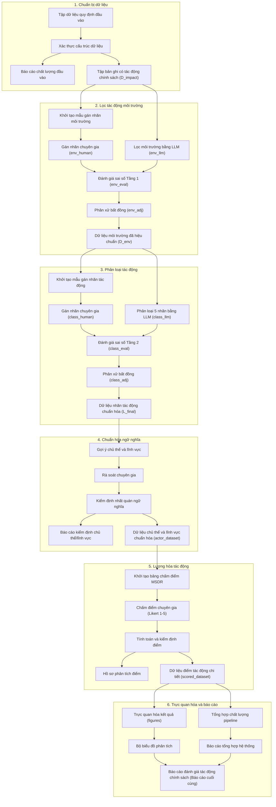

# Chương 2: PHƯƠNG PHÁP NGHIÊN CỨU VÀ KIẾN TRÚC HỆ THỐNG

## 2.1. Tổng quan khung lý thuyết: RIA, EIA và CBA

Đánh giá tác động chính sách môi trường là một bài toán khoa học mang tính liên ngành cao, đòi hỏi sự kết hợp chặt chẽ giữa khoa học chính sách công, khoa học môi trường và kinh tế học sinh thái. Khung phương pháp luận của đồ án được xây dựng dựa trên sự hợp nhất giữa ba phương pháp cốt lõi: Đánh giá tác động quy định (Regulatory Impact Analysis - RIA), Đánh giá tác động môi trường (Environmental Impact Assessment - EIA) và Phân tích chi phí - lợi ích (Cost-Benefit Analysis - CBA).

* **Đánh giá tác động quy định (RIA):** RIA đóng vai trò là lớp lọc logic đầu tiên trong hệ thống. Phương pháp này tập trung phân tích các điều khoản pháp luật dưới góc độ chính sách công nhằm xác định những quy định nào thực sự phát sinh tác động điều tiết xã hội. Một điều khoản được xác nhận có tác động quy định khi nó thiết lập các nghĩa vụ pháp lý, quyền lợi chủ thể, thủ tục hành chính, điều kiện áp dụng hoặc các lệnh cấm hành vi. Trong đồ án, RIA cung cấp cơ sở để xác lập trường dữ liệu tiên quyết `co_tac_dong = true` nhằm khoanh vùng các đơn vị pháp lý cần phân tích, loại bỏ các điều khoản thuần túy mang tính định nghĩa hoặc mô tả kỹ thuật không tạo nghĩa vụ.
* **Đánh giá tác động môi trường (EIA):** Trên cơ sở tập dữ liệu đã có tác động quy định, EIA được ứng dụng để lọc các điều khoản có tác động chuyên biệt đến môi trường và hệ sinh thái. Các tác động môi trường bao gồm các hoạt động trực tiếp hoặc gián tiếp liên quan đến quản lý chất thải, kiểm soát ô nhiễm nước, không khí, đất, đa dạng sinh học, biến đổi khí hậu, hoặc các công cụ hành chính như giấy phép môi trường và đăng ký môi trường. Đồng thời, EIA cung cấp hệ tiêu chí bán định lượng để đo lường mức độ nghiêm trọng và tính chất vật lý của tác động thông qua các biến quy mô, không gian, thời gian và mức độ rủi ro phục hồi.
* **Phân tích chi phí - lợi ích (CBA):** CBA đóng vai trò định hình cấu trúc nhãn phân loại và định hướng chiều tác động. Thay vì cố gắng quy đổi toàn bộ các tác động môi trường phức tạp thành giá trị tiền tệ tuyệt đối — một phương pháp thường không khả thi đối với văn bản pháp luật do thiếu dữ liệu thị trường trực tiếp, đồ án sử dụng nguyên lý của CBA để phân định rõ ràng hướng tác động tích cực (lợi ích) và tiêu cực (chi phí tuân thủ, ràng buộc hành vi). CBA định hướng cho việc xây dựng bộ nhãn phân loại 5 lớp và gán dấu vector hướng tác động để phục vụ mô hình lượng hóa.

Sự liên kết logic giữa ba phương pháp này tạo nên một cấu trúc phân tích đồng bộ: RIA đảm nhận vai trò lọc tác động quy định sơ khởi; EIA chịu trách nhiệm nhận diện tác động môi trường và xác định mức độ ảnh hưởng vật lý; CBA hoàn thiện mô hình bằng cách phân loại hướng tác động và tính điểm tích lũy.

---

## 2.2. Pipeline xử lý dữ liệu và vai trò hỗ trợ của Mô hình ngôn ngữ lớn (LLM)

Kiến trúc hệ thống DTM được thiết kế dưới dạng một chuỗi xử lý dữ liệu (pipeline) tuần tự gồm 6 giai đoạn cốt lõi, kết hợp hài hòa giữa thuật toán tự động hóa và rà soát chuyên gia (human-in-the-loop). Cấu trúc tổng thể được mô tả trực quan qua sơ đồ quy trình dưới đây:

### 2.2.1. Chi tiết các giai đoạn trong chuỗi xử lý (Pipeline)
* **Giai đoạn 1: Chuẩn bị dữ liệu:** Dữ liệu quy định pháp lý sau khi cấu trúc hóa sang định dạng JSON cấp điều/khoản sẽ được đưa vào mô-đun xác thực cấu trúc. Tại đây, hệ thống kiểm tra các ràng buộc schema và tính hợp lệ của trường bắt buộc nhằm xuất báo cáo chất lượng đầu vào, đồng thời kết xuất tập bản ghi có tác động chính sách ($D_{impact}$).
* **Giai đoạn 2: Lọc tác động môi trường:** Tập dữ liệu $D_{impact}$ được đưa qua bộ lọc Tầng 1. LLM tiến hành dự đoán nhãn nhị phân ($env\_llm$) song song và độc lập với nhãn gán của chuyên gia ($env\_human$). Hệ thống tự động so sánh hai tập nhãn này để đánh giá sai số phân loại trước khi hỗ trợ chuyên gia thực hiện phân xử bất đồng nhãn, chốt dữ liệu môi trường đã hiệu chuẩn ($D_{env}$).
* **Giai đoạn 3: Phân loại tác động:** Tập dữ liệu $D_{env}$ tiếp tục được đưa vào bộ phân loại Tầng 2. LLM dự đoán nhãn tác động đa lớp ($class\_llm$) song song với nhãn do chuyên gia gán ($class\_human$). Hệ thống tự động tính toán các chỉ số đánh giá sai số như ma trận nhầm lẫn, Macro-F1 và tỷ lệ hiệu chỉnh HCR trước khi chuyển sang bước phân xử bất đồng để chốt tập dữ liệu nhãn tác động chuẩn hóa ($L_{final}$).
* **Giai đoạn 4: Chuẩn hóa ngữ nghĩa:** Dựa trên các bộ từ khóa pháp lý cấu hình sẵn, hệ thống tự động nhận diện và gợi ý nhóm chủ thể chịu điều chỉnh chính và lĩnh vực tác động. Kết quả này được rà soát và hiệu chỉnh trực tiếp bởi chuyên gia trước khi chạy quy trình kiểm định nhất quán ngữ nghĩa để xuất tệp dữ liệu chuẩn hóa (`actor_dataset`).
* **Giai đoạn 5: Lượng hóa tác động:** Hệ thống khởi tạo bảng biểu chấm điểm tương ứng với tập dữ liệu. Chuyên gia tiến hành đánh giá các tiêu chí theo thang đo Likert dựa trên bộ tiêu chuẩn (rubric) MSDR. Hệ thống tự động kiểm tra tính hợp lệ của điểm chấm, tính toán điểm tác động chuẩn hóa ($ImpactScore_i \in [-1, 1]$) và xuất dữ liệu điểm tác động chi tiết (`scored_dataset`).
* **Giai đoạn 6: Trực quan hóa và báo cáo:** Hệ thống tự động vẽ các biểu đồ phân tích phân phối điểm (như biểu đồ tần suất - histogram, biểu đồ hộp - boxplot) và xuất báo cáo tổng hợp đánh giá chất lượng toàn bộ quy trình, tạo cơ sở dữ liệu hoàn chỉnh cho báo cáo phân tích chính sách môi trường cuối cùng.

### 2.2.2. Cơ chế kiểm soát phương pháp (Methodological Controls)
Để bảo đảm tính chính xác học thuật và ngăn ngừa hiện tượng sai số tích lũy qua các bước xử lý, hệ thống thiết lập 4 cơ chế kiểm soát phương pháp cốt lõi:
1. **Guideline nghiệp vụ:** Toàn bộ các bước lọc tác động, phân loại đa lớp, chuẩn hóa ngữ nghĩa và chấm điểm MSDR đều được chuẩn hóa bằng các bộ tài liệu hướng dẫn kỹ thuật chi tiết nhằm tối đa hóa tính đồng nhất và hạn chế tính chủ quan của người nghiên cứu.
2. **Đo hiệu năng trước phân xử:** Các chỉ số đo lường hiệu năng của LLM (Precision, Recall, F1, Macro-F1) bắt buộc phải được tính toán *trước* khi thực hiện phân xử bất đồng. Quy tắc này đảm bảo đánh giá trung thực năng lực của mô hình ngôn ngữ lớn, tránh việc sử dụng nhãn đã có sự can thiệp hiệu chỉnh của con người để tính toán hiệu năng.
3. **Phân xử có căn cứ:** Mọi quyết định điều chỉnh nhãn tại bước phân xử bất đồng của chuyên gia đều bắt buộc phải ghi nhận lập luận pháp lý (`reason`) và trích xuất bằng chứng ngữ cảnh (`evidence_span`) tương ứng từ văn bản gốc, tạo cơ chế đối chiếu và truy vết dữ liệu minh bạch.
4. **Kiểm định dữ liệu trước chấm điểm (Scoring):** Chạy kiểm định nhất quán logic của Actor/Domain và điểm chấm thành phần. Bất kỳ lỗi dữ liệu nghiêm trọng nào (`ERROR`) cũng sẽ kích hoạt cơ chế tự động đình chỉ (stop) chuỗi tính điểm để bảo đảm tính an toàn dữ liệu và tính đúng đắn của phép toán lượng hóa.

Trong toàn bộ chuỗi xử lý này, Mô hình ngôn ngữ lớn (LLM) được định vị là một trợ lý khai phá văn bản và đề xuất thông tin thông minh. Với năng lực hiểu ngữ cảnh sâu sắc, LLM không chỉ đưa ra các dự đoán phân loại mà còn đồng thời trích xuất lập luận giải thích và bằng chứng trực tiếp từ văn bản gốc. Sự kết hợp này mang lại khả năng giải thích cao cho mô hình học máy, hỗ trợ đắc lực cho người nghiên cứu trong quy trình kiểm chứng có con người tham gia (Human-in-the-loop - HITL).

---

## 2.3. Quy trình kiểm chứng có con người tham gia (Human-in-the-loop)

Một trong những nguyên tắc thiết kế bất di bất dịch của hệ thống DTM là không sử dụng trực tiếp các dự đoán thô của mô hình ngôn ngữ lớn làm nhãn kết quả cuối cùng. Do tính chất phức tạp và đòi hỏi trách nhiệm pháp lý cao trong phân tích chính sách công, quy trình kiểm chứng có con người tham gia (Human-in-the-loop - HITL) được thiết lập như một cơ chế bắt buộc để kiểm soát chất lượng dữ liệu.

Quy trình HITL hoạt động thông qua **Giao thức xử lý bất đồng nhãn (Adjudication Protocol)**. Với mỗi điều khoản $x_i$, hệ thống ghi nhận hai giá trị nhãn phân loại độc lập: nhãn do người nghiên cứu gán thủ công ($y_i$) và nhãn do LLM dự đoán ($\hat{y}_i$). Hệ thống tự động đối chiếu hai tập nhãn này:

* Nếu $y_i = \hat{y}_i$, bản ghi được ghi nhận là đạt được sự đồng thuận giữa người nghiên cứu và AI, hệ thống tự động gán nhãn cuối cùng $y^{final}_i = y_i$.
* Nếu $y_i \neq \hat{y}_i$, bản ghi được đưa vào danh sách rà soát bất đồng. Người nghiên cứu sẽ mở tệp rà soát, đối chiếu nội dung văn bản gốc, xem xét lý do lập luận và bằng chứng do LLM trích xuất để đưa ra quyết định hiệu chuẩn nhãn. Quyết định hiệu chuẩn này là quyết định cuối cùng để chốt nhãn $y^{final}_i$.

Để đo lường khối lượng công việc hiệu chuẩn thủ công và đánh giá mức độ tương thích giữa AI và con người, hệ thống định nghĩa chỉ số **Tỷ lệ hiệu chỉnh của con người (Human Correction Rate - HCR)**:

$$HCR = \frac{1}{M} \sum_{i=1}^{M} \mathbb{I}(y_i \neq \hat{y}_i)$$

Trong đó $M$ là số lượng bản ghi thực hiện đánh giá, và $\mathbb{I}(\cdot)$ là hàm chỉ thị nhận giá trị bằng 1 nếu biểu thức bên trong đúng và bằng 0 nếu biểu thức bên trong sai. Chỉ số HCR thể hiện tỷ lệ phần trăm số bản ghi mà con người bắt buộc phải can thiệp để sửa lỗi hoặc điều chỉnh nhãn dự đoán của LLM nhằm đạt mức chính xác học thuật cao nhất.

---

## 2.4. Các chỉ số đánh giá chất lượng phân loại

Để đánh giá khoa học năng lực phân loại của mô hình ngôn ngữ lớn trước khi tiến hành quy trình hiệu chuẩn nhãn, hệ thống sử dụng ma trận nhầm lẫn và các chỉ số đo lường hiệu năng học máy tiêu chuẩn.

Gọi $L = \{l_1, l_2, \dots, l_k\}$ là không gian nhãn tác động ($k = 5$ ở Tầng 2). Ma trận nhầm lẫn $C \in \mathbb{N}^{k \times k}$ được định nghĩa sao cho mỗi phần tử $C_{ij}$ biểu thị số lượng bản ghi có nhãn cơ sở thực tế của người nghiên cứu là $l_i$ nhưng mô hình ngôn ngữ lớn lại dự đoán là $l_j$. 

Từ ma trận nhầm lẫn $C$, các chỉ số được xác định cho từng lớp nhãn $l_m$ (với $m \in \{1, 2, \dots, k\}$):

* **Độ chính xác (Precision - $P_m$):** Đo lường tỷ lệ các dự đoán của LLM thuộc nhãn $l_m$ là chính xác so với nhãn của con người:
  $$P_m = \frac{C_{mm}}{\sum_{i=1}^{k} C_{im}}$$
* **Độ nhạy (Recall - $R_m$):** Đo lường tỷ lệ các bản ghi thực tế thuộc nhãn $l_m$ được LLM nhận diện thành công:
  $$R_m = \frac{C_{mm}}{\sum_{j=1}^{k} C_{mj}}$$
* **Điểm F1 (F1-score - $F1_m$):** Trung bình điều hòa giữa Precision và Recall của nhãn $l_m$, phản ánh hiệu năng cân bằng trên nhãn đó:
  $$F1_m = \frac{2 \cdot P_m \cdot R_m}{P_m + R_m}$$

Để đánh giá chất lượng tổng thể của hệ thống trên toàn bộ dataset, hệ thống sử dụng hai chỉ số tích hợp:

* **Độ chính xác tổng thể (Accuracy):** Tỷ lệ phần trăm tổng số bản ghi dự đoán đúng trên toàn bộ tập dữ liệu:
  $$Accuracy = \frac{\sum_{m=1}^{k} C_{mm}}{\sum_{i=1}^{k} \sum_{j=1}^{k} C_{ij}}$$
* **Chỉ số Macro-F1 (Macro-averaged F1-score):** Trung bình cộng không trọng số của điểm F1 trên tất cả các nhãn:
  $$Macro\text{-}F1 = \frac{1}{k} \sum_{m=1}^{k} F1_m$$

Trong bài toán đánh giá văn bản pháp luật, việc sử dụng chỉ số Macro-F1 là cực kỳ quan trọng do sự mất cân bằng dữ liệu cực đoan giữa các lớp nhãn (lớp `COST_QUALITATIVE` thường chiếm ưu thế tuyệt đối so với các lớp còn lại). Chỉ số Macro-F1 coi trọng vai trò của tất cả các lớp nhãn như nhau, ngăn chặn hiện tượng đánh giá thiên lệch khi mô hình chỉ dự đoán tốt trên lớp đa số mà thất bại trên các lớp thiểu số.

---

## 2.5. Phương pháp phân loại và chuẩn hóa đối tượng chịu tác động (Actors) và Lĩnh vực (Domains)

Để điểm số tác động chính sách có tính giải thích cao và hỗ trợ phân tích đa chiều, dữ liệu pháp lý cần được chuẩn hóa về mặt đối tượng chịu điều chỉnh và khía cạnh tác động môi trường. Nếu không chuẩn hóa, việc phân tích sẽ bị phân tán do sự đa dạng trong cách dùng từ của văn bản luật gốc.

### 2.5.1. Nhóm chủ thể chịu tác động (Actor Groups)
Mỗi điều khoản được chuẩn hóa để gán vào một nhóm chủ thể chịu điều chỉnh chính thuộc không gian gồm 5 nhóm tiêu chuẩn:
1. `GENERAL_ORGANIZATION_INDIVIDUAL`: Nhóm tổ chức, cá nhân nói chung (các nghĩa vụ phổ quát).
2. `STATE_AGENCY`: Cơ quan quản lý Nhà nước các cấp (trách nhiệm quản lý hành chính, giám sát, cấp phép).
3. `PROJECT_OWNER_INFRASTRUCTURE`: Chủ đầu tư dự án, chủ đầu tư xây dựng hạ tầng kỹ thuật.
4. `BUSINESS_FACILITY`: Doanh nghiệp, nhà máy, cơ sở sản xuất kinh doanh đang hoạt động.
5. `COMMUNITY_CRAFT_VILLAGE`: Cộng đồng dân cư và các hộ sản xuất tại các làng nghề truyền thống.

### 2.5.2. Lĩnh vực môi trường chính (Primary Domains)
Khía cạnh tác động môi trường của mỗi điều luật được ánh xạ vào một trong 13 lĩnh vực chính nhằm phục vụ phân tích chuyên đề:
* `water` (Tài nguyên nước); `waste` (Chất thải rắn); `hazardous_substances` (Chất độc hại & POPs); `eia_permit_registration` (ĐTM, Giấy phép & Đăng ký môi trường); `air_noise_radiation` (Không khí, Tiếng ồn & Bức xạ); `planning_state_management` (Quy hoạch & Quản lý); `biodiversity_natural_heritage` (Đa dạng sinh học & Di sản); `technical_standard_threshold` (Quy chuẩn kỹ thuật); `climate_carbon` (Biến đổi khí hậu & Cacbon); `pollution_control_remediation` (Kiểm soát & Khắc phục ô nhiễm); `monitoring_reporting` (Quan trắc & Báo cáo); `environmental_finance` (Tài chính môi trường); và `general_environment` (Môi trường chung).

### 2.5.3. Quy trình phân loại tự động và kiểm duyệt dữ liệu
Quy trình chuẩn hóa được thực thi thông qua cơ chế hai bước chạy bằng code:
1. **Gợi ý tự động (Script 09b):** Hệ thống quét nội dung văn bản gốc (`raw_text`) dựa trên các bộ quy tắc từ khóa (regex-based rules) được định nghĩa trong tệp cấu hình `actor_domain_config.yaml`. Nếu phát hiện từ khóa tương ứng (ví dụ: "Ủy ban nhân dân" khớp với `STATE_AGENCY`, "nước thải" khớp với `water`), hệ thống tự động gán nhãn gợi ý. Nếu bản ghi chứa các từ khóa trùng lặp hoặc mơ hồ, trường logic `actor_needs_review` hoặc `domain_needs_review` sẽ tự động đánh dấu là `True`.
2. **Kiểm định dữ liệu (Script 09c):** Người nghiên cứu tiến hành rà soát thủ công các bản ghi được đánh dấu cần rà soát và điền giá trị hiệu chuẩn. Sau đó, script 09c thực hiện kiểm định nghiêm ngặt toàn bộ bảng dữ liệu. Bất kỳ giá trị nào sai lệch chính tả hoặc nằm ngoài danh mục chuẩn hóa sẽ bị trả về lỗi chặn (`ERROR`), bắt buộc phải sửa đổi trước khi chuyển tiếp sang bước chấm điểm.

---

## 2.6. Mô hình toán học lượng hóa tác động chính sách (Mô hình bán định lượng MSDR)

Sau khi có nhãn cuối cùng ($y^{final}_i \in L$) và thông tin chủ thể/lĩnh vực đã chuẩn hóa, hệ thống tiến hành lượng hóa tác động của từng điều luật bằng mô hình toán học bán định lượng dựa trên Khung đánh giá tác động tích hợp (MSDR).

### 2.6.1. Xác định hướng tác động ($s_i$)
Hướng tác động $s_i \in \{-1, +1\}$ xác định tính chất đóng góp của điều luật vào phúc lợi xã hội hoặc chi phí tuân thủ:
* Với các điều luật mang nhãn lợi ích ($BQ, BQL$), hướng tác động được gán giá trị dương: $s_i = +1$.
* Với các điều luật mang nhãn chi phí hoặc ràng buộc ($CQ, CQL, CON$), hướng tác động được gán giá trị âm nhằm biểu thị gánh nặng tuân thủ hoặc hạn chế hành vi: $s_i = -1$.

### 2.6.2. Đo lường các biến thành phần thang Likert
Mỗi điều khoản được chấm điểm trên thang điểm rời rạc từ 1 đến 5 đối với 4 biến đo lường vật lý:
1. **Cường độ tác động ($M_i$):** Mức độ nghiêm ngặt hoặc biên độ ảnh hưởng của quy định lên hành vi của chủ thể (từ 1 - rất nhẹ, chỉ mang tính khuyến nghị hành vi; đến 5 - rất mạnh, thay đổi hoàn toàn quy trình hoạt động hoặc cấm tuyệt đối).
2. **Không gian ảnh hưởng ($S_i$):** Phạm vi địa lý hoặc quy mô phân bố đối tượng chịu tác động (từ 1 - cấp cơ sở, một doanh nghiệp cụ thể; đến 5 - cấp quốc gia, áp dụng chung cho toàn dân hoặc toàn bộ các chủ thể kinh tế).
3. **Thời gian tác động ($D_i$):** Khoảng thời gian quy định phát sinh hiệu lực điều tiết (từ 1 - ngắn hạn, mang tính nhất thời hoặc giai đoạn dưới 1 năm; đến 5 - dài hạn, có hiệu lực vĩnh viễn hoặc áp dụng xuyên suốt vòng đời của luật).
4. **Mức độ rủi ro của lĩnh vực ($R_i$):** Mức độ nguy cấp, rủi ro sinh thái hoặc khả năng khó khắc phục hậu quả của lĩnh vực môi trường tương ứng (ví dụ: các lĩnh vực biến đổi khí hậu hoặc hóa chất độc hại được mặc định định mức rủi ro nền cao $R_i \ge 4$).

### 2.6.3. Công thức tính điểm tác động chính sách
Điểm thô tổng hợp $C_i$ được tính bằng phương pháp cộng tuyến tính có trọng số:
$$C_i = \alpha M_i + \beta S_i + \gamma D_i + \delta R_i$$
Trong thực nghiệm hiện tại của đồ án, bốn tiêu chí được giả định có vai trò ngang nhau đối với tác động chính sách, do đó hệ số trọng số thành phần được gán giá trị mặc định bằng nhau:
$$\alpha = \beta = \gamma = \delta = 0.25$$
Vì $M_i, S_i, D_i, R_i \in [1, 5]$ và tổng các hệ số bằng 1, nên giá trị điểm thô $C_i$ cũng nằm trong khoảng $[1, 5]$. Ta chuẩn hóa tuyến tính điểm số về đoạn $[0, 1]$ để loại bỏ ảnh hưởng của điểm xuất phát thang Likert:
$$C_{norm\_i} = \frac{C_i - 1}{4}$$
Cuối cùng, Điểm tác động chính sách ($ImpactScore_i$) của điều khoản thứ $i$ được xác định bằng công thức tích hợp:
$$ImpactScore_i = s_i \times W_i \times C_{norm\_i}$$
Trong đó $W_i$ là trọng số ưu tiên chính sách hoặc trọng số hệ sinh thái của đối tượng (mặc định $W_i = 1.0$). Giá trị $ImpactScore_i$ sẽ nằm trong đoạn $[-1, 1]$. Tổng điểm tác động tích lũy toàn bộ văn bản quy phạm pháp luật được tính bằng:
$$TotalImpact = \sum_{i=1}^{M} ImpactScore_i$$

### 2.6.4. Phân tích độ nhạy và các mô hình toán học đề xuất mở rộng
Để kiểm chứng tính ổn định của điểm số khi có sự thay đổi về mặt trọng số thành phần, hệ thống hỗ trợ tham số hóa các trọng số $(\alpha, \beta, \gamma, \delta)$ khi chạy script 11. Hướng phát triển nâng cao của mô hình là ứng dụng phương pháp Phân tích phân cấp (Analytic Hierarchy Process - AHP) thông qua việc lấy ý kiến khảo sát từ các chuyên gia môi trường để xây dựng ma trận so sánh cặp, từ đó xác lập bộ trọng số thành phần có căn cứ khoa học thay vì giả định bằng nhau.

Đối với các nhãn định lượng ($BQ, CQ$), nếu trong tương lai hệ thống thu thập được các giá trị thực tế $V_i$ (ví dụ: số tiền phạt bằng VNĐ hoặc lượng phát thải giảm bằng tấn $CO_2$), điểm chuẩn hóa có thể áp dụng hàm chuẩn hóa Min-Max thay vì thang đo Likert:
$$C_{norm\_i} = \frac{V_i - V_{min}}{V_{max} - V_{min}}$$

Đối với nhãn ràng buộc nghiêm ngặt ($CON$), nhằm phản ánh rủi ro đứt gãy hệ thống hoặc hậu quả nghiêm trọng nếu vi phạm quy chuẩn/lệnh cấm, mô hình toán học đề xuất có thể áp dụng một hàm phạt phi tuyến (Non-linear Penalty Function) với hệ số phạt $\kappa > 1$ để khuếch đại điểm tác động âm:
$$C_{norm\_i} = \left(\frac{C_i - 1}{4}\right)^\kappa$$
Tuy nhiên, trong phạm vi thực nghiệm hiện tại của đồ án, do tập dữ liệu thực tế không có nhãn định lượng ($BQ/CQ$ có support bằng 0) và để bảo đảm tính nhất quán, ổn định trong phân phối điểm số so sánh trực tiếp, toàn bộ 581 điều khoản đều được tính toán theo mô hình tuyến tính SAW đồng nhất.
